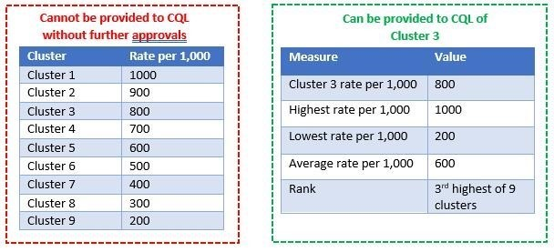

# LIST IG Approvals Framework 

## Before Starting a Project

Before starting any project, there are a number of questions we should ask ourselves. We can then consult the LIST IG Approvals Framework to determine the way forward.

1. Who is my primary customer/contact? 

    - Determining your primary customer or contact for your project will be done during your initial meeting with the customer e.g. GP cluster or practice quality lead; HSCP service manager. 

1. Why are they asking for this data/information? 

    - Define clear aim(s) and objective(s) of the project in collaboration with your customer. 

1. Where is the data coming from?  

    - Map desired outcomes and variables to available data sources (local and/or national). 

1. Who owns that data?  

    - Identify data owner(s) and whether you need to gain permission to access that data. 

1. How do I access the data required? 

    - National data: Public Health Scotland 
    - GP data: Cluster or Practice Quality Lead  
    - Local data: Please discuss this with your local contacts 
    - Other: Third sector or partner organisations 

1. Am I using the minimum amount of variables/information required to do this project? 

    - Review variables / information required by your customer. 
    - _Data Minimisation is a key principle of Data Protection Law, meaning personal data should only be used when necessary_

1. Do I require patient-identifiable data? 

    - If you do require patient-identifiable data for your analysis, the best practice is to produce aggregate data outputs for the customer and use this to focus discussion on further details. 

1. Who is getting access to the data once I am finished with my analysis? 

    - Identify who will have access to the data and what level of information / data is therefore appropriate to present in your outputs e.g. aggregated vs. person identifiable data.  
    - Ask yourself “Do they have a genuine need to see all of the data I intend to give them?” 

1. Is there a way to provide this data that would not require disclosure of personally identifiable information? 

    - Consider ways in which you could present the data to your customer e.g. by aggregating the data by cluster, locality or GP practice. 

## About The Framework

The LIST IG Approvals Framework was implemented in January 2024 in order to outline who LISTs main customers are and the level of data we can provide to them. This depends on: 

1. Who the customer is 

    - _NHS Board customer_

    - _Local Authority customer_

    - _Cluster Quality Lead (CQL)_

    - _GP Practice Staff (who are not CQLs)_

1. The level of data required  

    - _Level 0: Published_

    - _Level 1: Aggregated Non Confidential / Publishable_

    - _Level 2: Potentially Disclosive / Management Information_

    - _Level 3: Patient Level_

    - _Non-PHS, Local data sources_

1. Whether the data required falls into the customers own geographic area of responsibility 

The framework is intended to be a useful tool for analysts to determine appropriate outputs for our customers. It can be found on the [LIST SharePoint Page](https://scottish.sharepoint.com/:x:/r/sites/PHS-LIST/_layouts/15/Doc.aspx?sourcedoc=%7B4675F488-0BED-48E2-967F-4D006D7BA596%7D&file=LIST%20IG%20Approvals%20Framework.xlsx&action=default&mobileredirect=true)

## Our Customers

LIST support two main workstreams: Health & Social Care Integration and Primary Care. Under the LIST IG Framework, there are four categories of customers LIST can send PHS data directly to: 

- NHS staff 

- Local Authority staff – (within a Health and Social Care Partnership) 

- Cluster Quality Leads (CQLs) 

- GP Practice Staff (who are not CQLs) 

_**What about other customer types?**_

- _ADP/CPP customers_

    LIST’s “direct customer” should be either a local authority or NHS employee who is a member of the ADP / CPP. LIST are not permitted to share data direct with ADP/CPP members from organisations outwith of NHS Board / Local Authority Staff. These organisations are trusted partner organisations of PHS where we already have an approved mechanism for sharing data with, other organisations included in the ADP/CPPs may not have such mechanisms in place. 

- _Universities_

    LIST do not support universities directly. LIST’s only interaction with university contacts should be via one of the 4 main customer types. For example, a HSCP may have commissioned a university to carry out analysis on their behalf. LIST only provide requested data direct to one of the 4 main customer types, never direct to the university contact. It is then for LIST’s customer to then share this data, ensuring they follow both PHS and local IG protocols as required. 

- _Third Sector_

    LIST do not support third sector organisations directly. LIST support third sector organisations on behalf of the HSCP. LIST would provide data direct to HSCP contact(s), then the HSCP contact would be responsible for sharing this data with the third sector, ensuring they follow both PHS and local IG protocols as required. 

_**What about data which isn’t held by PHS?**_

When we are requested to work with customers using their own local data sources, we must adhere to the local IG processes they have in place. 

## Comparator Data

It is common for customers to request their own data in the context of comparator data from other areas, to be able to compare their performance relative to others. Below are the key considerations for LIST to determine the data they can / can’t provide without further approvals in place. 

_**Who is the customer and what information does their role entitle them to?**_

Refer to the LIST IG framework for details on the data that different customer types are entitled to with/ without approvals. 

LIST can provide customers with data for their own geographic area of responsibility. We should not provide any data to a customer that means they can  gain intelligence about other areas or organisations that are outwith their responsibility, unless we: 

- Obtain senior approval from the area

- Use data available in the public domain – no approvals are required. 

_**What data can LIST provide if no further approvals are obtained**_

LIST can provide data for the customer’s _own geographic area of remit_. 

LIST cannot show/name other areas in the output, this includes LIST not being permitted to show the data with anonymised names. As these areas are outwith the customers area of remit, the customer is not entitled to this data without approvals in place. 

LIST can provide some limited comparator data to allow the customer to see how their area compares to others. LIST can provide: 

- Highest count/rate for the area 

- Lowest count/rate for the area 

- Average count/rate  

- The relative position/rank of the customer’s area compared to others. 


_Example 1: GP Cluster requests data to compare their own cluster against other clusters in the NHS Board or HSCP_

```{r, echo=FALSE, out.width="100%"}

```

Note: LIST must ensure that there are a sufficient number of comparators that no intelligence can be gained about others. 

_Example 2: NHS Board containing 2 HSCPs: HSCP A and HSCP B._

A local authority customer from HSCP A requests comparative data for their HSCP’s relative position with their NHS Board. It is not possible to provide the maximum/minimum/average/ranking data as there are only 2 HSCPs in the NHS Board. 

Providing this information would be providing data for HSCP B. The local authority customer is not entitled to this data, approvals are required from HSCP B. 

## Unpublished Data

Sometimes our customers may ask for the release of unpublished data for all HSCPs / NHS Boards in Scotland, and not just their own. The default approach will be for LIST to _provide the HSCP / HB with data for their own area only_. 

For any comparative data, we will not provide any named HSCPs / HBs outwith their own area, we will provide the Scotland average, their own HSCP / HB’s position when ranked against the others e.g. their HSCP rate is ranked X / 31 (and also provide any required caveats re how feasible it is to compare areas in this way). 


